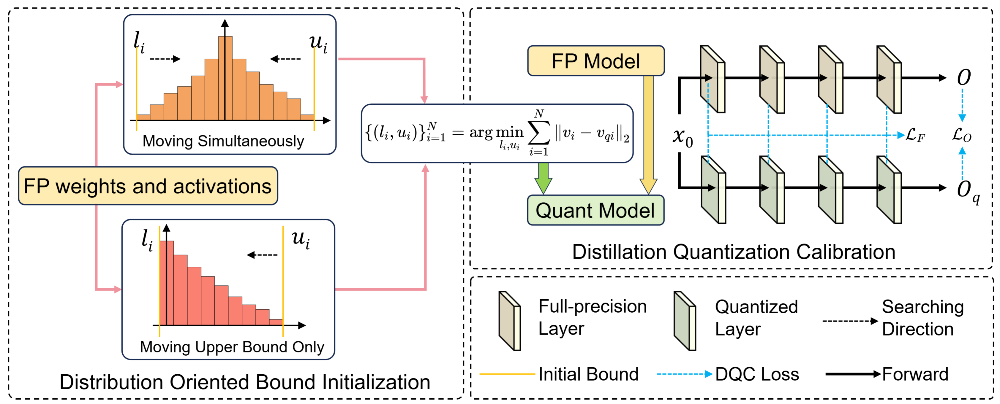
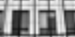
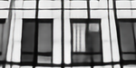
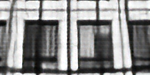
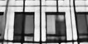
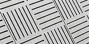
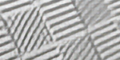
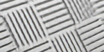
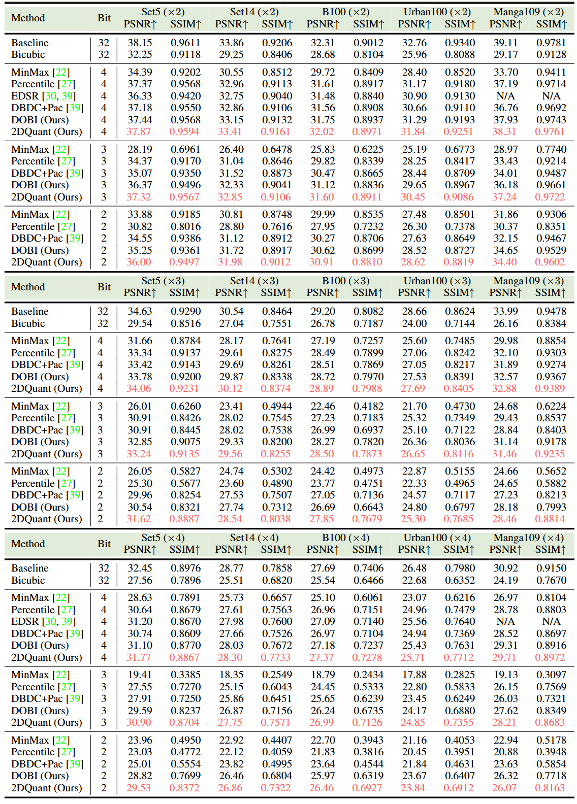
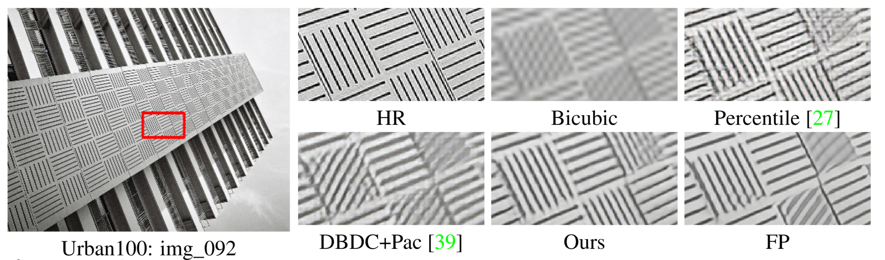

# 2DQuant: Low-bit Post-Training Quantization for Image Super-Resolution

[Kai Liu](https://kai-liu001.github.io/), [Haotong Qin](https://htqin.github.io/), [Yong Guo](https://www.guoyongcs.com/), [Xin Yuan](https://en.westlake.edu.cn/faculty/xin-yuan.html), [Linghe Kong](https://www.cs.sjtu.edu.cn/~linghe.kong/), [Guihai Chen](https://cs.nju.edu.cn/gchen/index.htm), and [Yulun Zhang](http://yulunzhang.com/), "2DQuant: Low-bit Post-Training Quantization for Image Super-Resolution", arXiv, 2024

[[arXiv]()] [visual results] [pretrained models]

#### 🔥🔥🔥 News

- **2024-06-09:** This repo is released.

---

> **Abstract:** Low-bit quantization has become widespread for compressing image super-resolution (SR) models for edge deployment, which allows advanced SR models to enjoy compact low-bit parameters and efficient integer/bitwise constructions for storage compression and inference acceleration, respectively. However, it is notorious that low-bit quantization degrades the accuracy of SR models compared to their full-precision (FP) counterparts. Despite several efforts to alleviate the degradation, the transformer-based SR model still suffers severe degradation due to its distinctive activation distribution. In this work, we present a dual-stage low-bit post-training quantization (PTQ) method for image super-resolution, namely 2DQuant, which achieves efficient and accurate SR under low-bit quantization. The proposed method first investigates the weight and activation and finds that the distribution is characterized by coexisting symmetry and asymmetry, long tails. Specifically, we propose Distribution-Oriented Bound Initialization (DOBI), using different searching strategies to search a coarse bound for quantizers. To obtain refined quantizer parameters, we further propose Distillation Quantization Calibration (DQC), which employs a distillation approach to make the quantized model learn from its FP counterpart. Through extensive experiments on different bits and scaling factors, the performance of DOBI can reach the state-of-the-art (SOTA) while after stage two, our method surpasses existing PTQ in both metrics and visual effects. 2DQuant gains an increase in PSNR as high as 4.52dB on Set5 ($\times 2$) compared with SOTA when quantized to 2-bit and enjoys a 3.60 $\times$ compression ratio and 5.08 $\times$ speedup ratio.

---

---

|                            HR                             |                               LR                               | [SwinIR-light (FP)](https://github.com/JingyunLiang/SwinIR) |          [DBDC+Pac](https://openaccess.thecvf.com/content/CVPR2023/html/Tu_Toward_Accurate_Post-Training_Quantization_for_Image_Super_Resolution_CVPR_2023_paper.html)          |                         2DQuant (ours)                         |
|:---------------------------------------------------------:|:--------------------------------------------------------------:|:---------------------------------------------------------------------------------------:|:-----------------------------------------------------------:|:----------------------------------------------------------------:|
|  |  |                               |  |  |
|  |  |                               |  |  |

## TODO

* [ ] Release code and pretrained models

## Contents

1. Datasets
1. Models
1. Training
1. Testing
1. [Results](#results)
1. [Citation](#citation)
1. [Acknowledgements](#acknowledgements)

##  Results

We achieved state-of-the-art performance. Detailed results can be found in the paper.

Click to expand

- quantitative comparisons in Table 3 (main paper)

  

- visual comparison in Figure 1 (main paper)

  

- visual comparison in Figure 6 (main paper)

  

- visual comparison in Figure 12 (supplemental material)

  

##  Acknowledgements

This code is built on [BasicSR](https://github.com/XPixelGroup/BasicSR).
